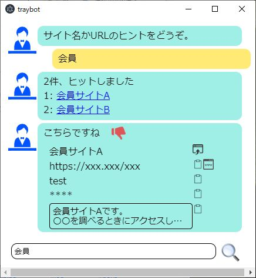

# traybot
Private standalone chatbot for personal use.

- This sends no data to outside of your PC.
  So you can remenber secret information(like password) in this tool.
- Message resource is only Japanese now.

## 1. how to install ( only for windows )
1. Get installer ( release/TrayBot Setup x.x.x.exe)
2. Run the installer, then select run.
3. You can find traybot icon in Windows task tray.
3. If you want to run at Windows starts, put the short cut of TrayBot.exe into Windows "shell:startup" folder.
run

## 2. how to run for developper
1. Clone this repository
2. Run "electron ." at the top of directory.

## 3. how to make installer
1. Run "node js/buildwin.js
2. Then you get installer at dist folder.
